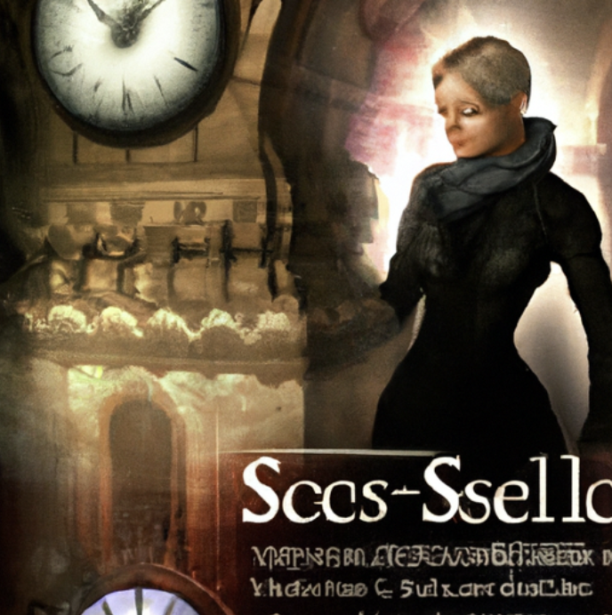
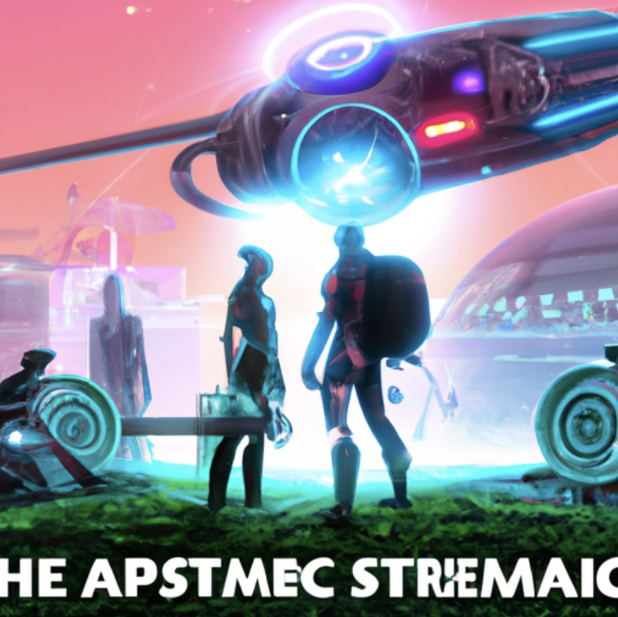
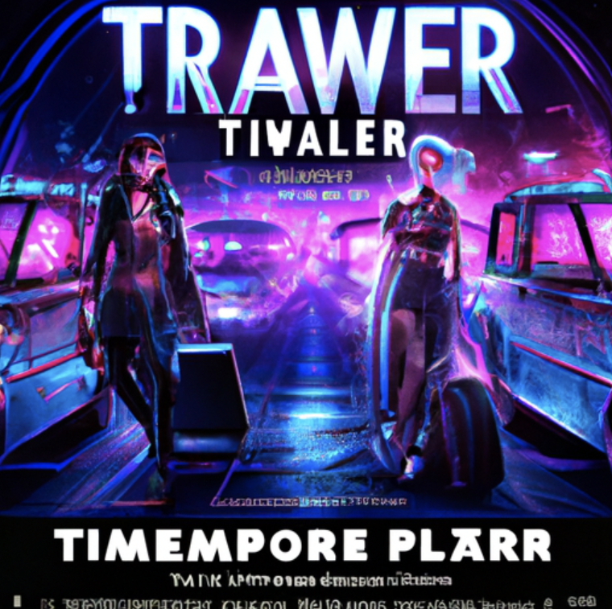
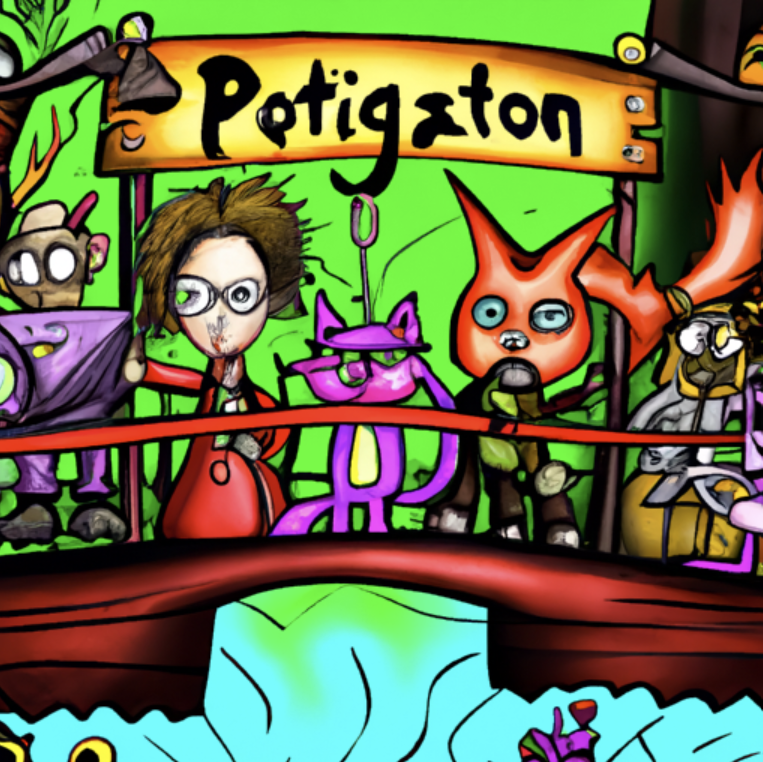
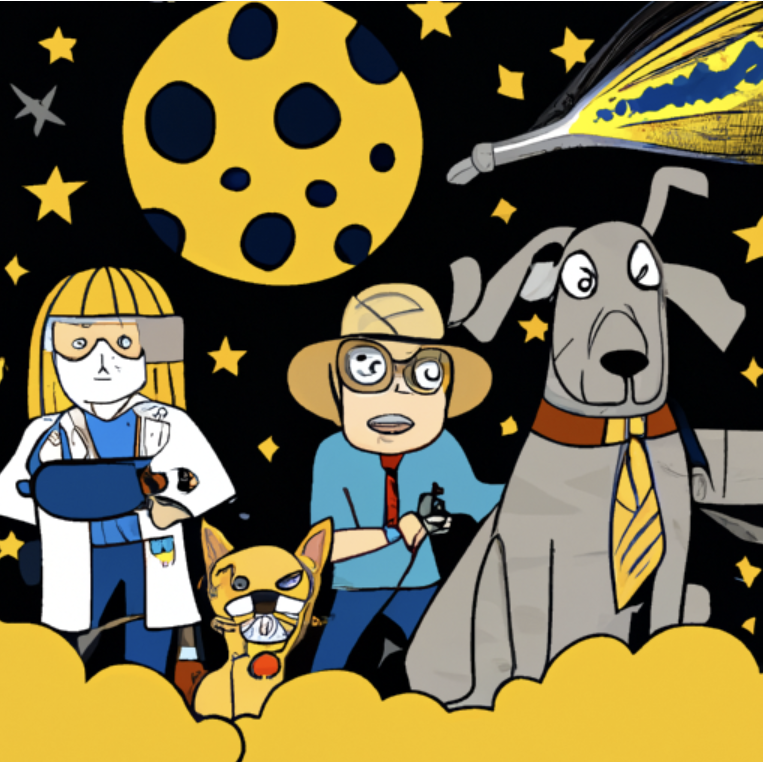

# Encode AI Team 7: StoryTime GPT

## Project Description

StoryTime creates imaginations into short stories. Need a quick bedtime story? Use your voice and describe your current mood or interests. StoryTime will creatively generate a short story. Create a new story or go back to your favorites anytime!

### Sample Demo

https://github.com/Encode-AI-Q1-2024-Team7/final-project-storyboard-gpt/assets/105133922/0ab7c321-50a1-4dba-b9ff-379b1ebc49b0

## How we made it

### AI Description

In our project, we employed three AI APIs to generate stories, summaries, and accompanying images based on narrative prompts. Here's a breakdown of our approach:
#### Story Generation
We utilized the OPENAI Assistant API to generate engaging narratives. By assigning the assistant the persona of a renowned sci-fi writer, we ensured immersive storytelling experiences.
#### Summary Generation
Leveraging the capabilities of the OPENAI Chat API, we extracted concise summaries from the generated sci-fi stories. 
#### Image Generation
To complement our stories, we employed the DALLE-3 model to produce visual representations. 

##### Fine-Tuning Examples
###### Step 1 (Original Concept):
Initially, our images reflected a traditional sci-fi aesthetic, which we found to be outdated.


###### Step 2 (Cyberpunk Theme):
Transitioning to a cyberpunk theme introduced visually striking elements, though facial features remained inconsistent and sometimes distorted.


###### Step 3 (Detailed Focus):
Despite efforts to enhance character details, challenges persisted in achieving satisfactory facial rendering.


###### Step 4 (Animated Approach):
Implementing an animated theme proved successful, as it offered greater tolerance for unconventional facial features.


###### Step 5 (Word Removal):
Finally, we refined our images by removing extraneous text, ensuring clarity and focus on visual storytelling.


### Dependencies
- NextJs / Typescript
- Tailwind / DaisyUI / React Aria Components
- OpenAI

## Instructions

### 1. Clone git repo

### 2. Install Dependencies

From root directory

```text
npm install
```

### 3. Setting up your keys and OPEN AI Assistant

- Rename `.env.example` to `.env.local`

- Include your Open AI key for `OPENAI_API_KEY=` in the env file
  - Sign up for an api key at [OpenAI](https://openai.com/)
- (Optional) Include an `ASSISTANT_ID=` in the env file. A new assistant will be created if one is not provided.

---

### 4. Run App

Run command in terminal of root directory:

```text
npm run dev
```

Open link in browser (Default link): [http://localhost:3000/](http://localhost:3000/)

## Team Members
- 👨‍💻 [Chris Salvador](https://github.com/csalvador58)
- 👩‍💻 [Vivien Zhou](https://github.com/vivienzhou2014)
- 👨‍💻 [Ahmed Shalabi](https://github.com/aashalabi)
